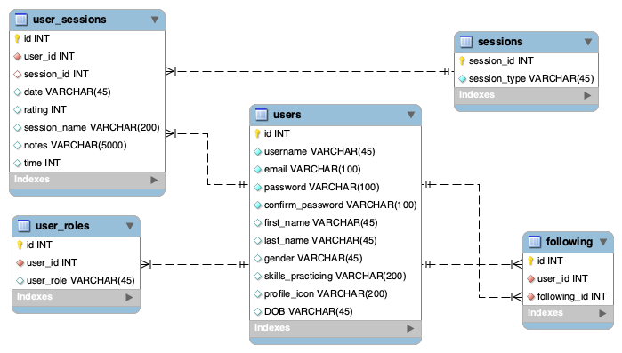

# **PRACTICE TRACKER**

**by Amadeusz Sepko**

The Practice Tracker is an application that allows users to record their practice sessions and keep a running record of previously recorded sessions.

### Page Descriptions
Pages are ordered alphabetically:
1. Data Entry: This page is to allow users to input their practice sessions. It will include information like date, session type (list retrieved from session table), name of session, time spent, session rating (out of 5 stars), and notes for the user to later reflect on if they wish to do so. The information that will be publicly displayed on the user pages will include session date, session name, and time spent. This page also doubles as a data entry edit page when accessed from an already created entry. After an entry is created or updated, a user is taken to a success page which will have a link to their list of entries.
2. Entries: This page lists all of a user's previous entries. The user will be able to see their entries in order of most recent. The user can see the session date, session name, time spent, notes, rating, and session type. From here a user also has the option to edit or delete each session. The user will be returned to this page once they create or edit an entry.
3. Following List: This page displays all the users the authenticated user is following. From here they will be able to see a user's icon, username, and skills they are practicing. Clicking on the username will take you to the user's profile page.
4. Index: This is just the homepage that users will be greeted with when they come to the site and redirected to once they log in. The navigation bars show more options once a user has logged in.
5. Login: Typical login page - user inputs correct username and password and is authenticated and able to access the rest of the site.
6. Register: This page doubles as a user registration page and user information edit page, depending on if a user is logged in or not. Users will input (or change) their first name, last name, email, username (will not be able to change later when editing), password, gender, date of birth, what skills they are practicing, and a profile icon that they desire. After submission, their data is sent to the database as either a new entry or an update.
7. User List/Search: This page allows users to search for registered users by username, first name, or last name. When a query returns a search result, you will see a user's profile icon, username, and full name. The username and full name will link to a user's profile page. 
8. User Profile: This page is either that of the current authenticated user (accessible through the Profile link in the navigation) or that of a user that is accessed from a search result or a user's following list. This page will show a user's username, first name, last name, profile icon, what skills they are working on, and their 3 most recent entries. If the profile does not belong to the currently logged-in user, an option to follow or unfollow a user shows up, which will allow a user to add someone to their following list to quickly access their profiles without having to search.

### Challenges

- One challenge I had was combining multiple tables in a single query. This was fixed by using `List<Map<String,Object>> ` and selecting which columns I wanted to includ in the query results. This was helpful in pulling the session type name when displaying user sessions (which only contain the session type id) and when I needed to pull user information to use with the following users table to show the followed user's information. Using a native query also helped with this problem to get exactly the information I needed to extract.
- Another issue I had was having only certain things display that were dependent on whom the active user was, such as the follow and unfollow function on the user profile pages. I wanted to ensure that if a user accessed their own profile page through the search that they would not be given the option to add themselves to their list of users they follow. This was done in combination with some logic in the controller that would check whether the active user was the same as the user whose profile page was being currently viewed and `<c:choose>`, `<c:when>`, and `<c:otherwise>` tags in the JSP pages. 
- Another issue that I came across was following and unfollowing users, which was accomplished used `.save()` and `.delete()` methods. I had to write code that would check if a relationship between the current user and the user they were following already existed and then run the method that would either follow or unfollow the user.
- The final issue I had was with the creation of forms and passing information from radiobutton, date pickers, and dropdown menus. I had to use the spring-form JSP tag library tags such as `<forms:radiobutton>` or `<forms:select>`. The use of this library also allowed forms to prepopulate if there was available information, such as on the edit account page or edit entry page.

### Schema Diagram

### Sketch of wireframes drawn out on iPad to plan first few page layouts and contents

### User Stories
- As a user, I want to be able to log in so that I can access my account
- As a user, I want to be able to view my profile so that I can see my stats
- As a user, I want to be able to input my practice time so that I can keep track of my practice time
- As a user, I want to add notes to practice sessions to be able to reflect on them
- As a user, I want to be able to access past sessions from a list so that I can see how much I practiced in the past
- As a user, I want to be able to select a practice session type
- As a user, I want to find other users and follow them
- As a user, I want to access a "Following" list to see all the users I follow
- As a user, I want to see other user's profiles
- As a user, I want to be able to edit previously input practice sessions so that I can make adjust what I see necessary
- As a user, I want to rate my practice sessions on a 5-star scale so that I can see how well past sessions went
- As a user, I want to be able to change my account information so that I have the option to change it if I wish to do so
- As a user, I want to be able to share publicly what I am working on and my three most recently recorded sessions
